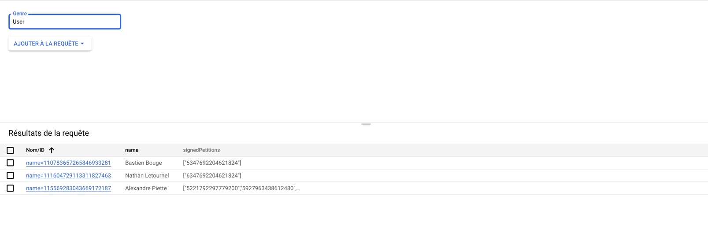
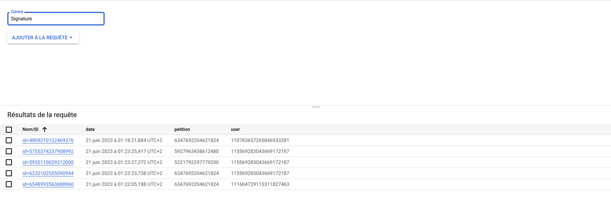

appengine-standard-archetype
============================

This is a generated App Engine Standard Java application from the appengine-standard-archetype archetype.

See the [Google App Engine standard environment documentation][ae-docs] for more
detailed instructions.

[ae-docs]: https://cloud.google.com/appengine/docs/java/

Nathan Letournel, Bastien Bastien, Alexandre Piette

README.md
# Projet de Pétitions
Ce projet est une plateforme pour créer et signer des pétitions. Il comprend une API backend et une interface utilisateur frontend.

## Problèmes connus
Problèmes Frontend : En raison d'un certain nombre de problèmes techniques, nous n'avons pas été en mesure de finaliser l'interface utilisateur frontend. Nous travaillons actuellement à la résolution de ces problèmes et espérons avoir une interface utilisateur opérationnelle sous peu.

## Problèmes de déploiement sur Google Cloud Platform (GCP) 
Nous rencontrons actuellement des difficultés à déployer l'application sur GCP. Nous pensons que ces problèmes sont liés à des problèmes avec le Cross-Origin-Opener-Policy. Nous travaillons activement à la résolution de ces problèmes.

## Backend
Notre backend est construit avec Objectify, une librairie simplifiant les interactions avec le Google Cloud Datastore. Ce choix nous permet de manipuler facilement les données sous forme d'objets Java, optimisant ainsi le développement.

Pour gérer les signatures de manière performante et scalable, nous avons mis en place un mécanisme de multithreading. Ainsi, même si le nombre affiché de signatures n'est pas instantanément précis, le système est capable de gérer un grand volume de signatures par seconde, garantissant une performance et une évolutivité optimales.
* [Java 8](http://www.oracle.com/technetwork/java/javase/downloads/index.html)
* [Maven](https://maven.apache.org/download.cgi) (at least 3.5)
* [Google Cloud SDK](https://cloud.google.com/sdk/) (aka gcloud)

## Entités
Pour représenter nos données, nous avons utilisé 4 entités dans le datastore : 
* les pétitions
* Les signatures
* Les utilisateurs
* Les tags

Voici le schéma des entités stockés dans le datastore GCP :

Les pétitions :

Les utilisateurs :                               
                                              

Les signatures :                        
                                          
   

Les tags :                        
                                          
      